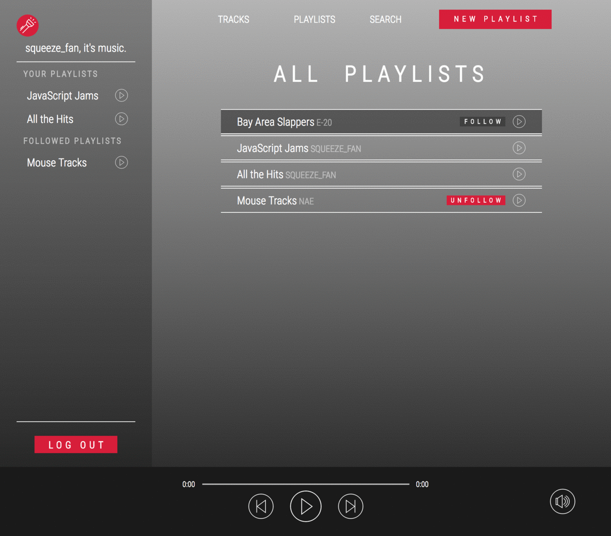

# Spooky

[Spooky][live-link] is a streaming music app inspired by [Spotify][spotify]. It is a single-page full-stack web application built on React/Redux, Ruby on Rails, and a ProgresSQL database.

## Features

* User accounts, with secure authentication both on the back- and frontends.

* Users can create playlists and add songs to them.

* Playlists are followable by users

* Live asynchronous search

### Playlist creation

### Browsing and following playlists

### Live asynchronous search

## Project Design

Spooky was designed over a two week period in Summer 2017. The [initial proposal]BLAH includes MVP features, an implementation timeline and more extensive documentation.

## Technologies

Spooky is built on a Ruby on Rails (Rails 5) backend. It uses a RESTful API and a PostgresSQL database. All backend data is served as JSON, and rendering of HTML is taken care of exclusively by React.js.

On the frontend, AJAX requests are made through jQuery. The returned JSON objects are parsed and handled by React following the Redux implementation of the Flux methodology. The state is unidirectional and modular with separate slices and reducers for session/user, playlists, tracks, and playback status. The state is semi-normalized although the small scale of the app allows some more duplication of information.

Audio playback is through [howler.js][howler] an open source library from GoldFire Studios. Howler objects are controlled through a scratch-built UI which interfaces with a react-howler wrapper for some functions and directly manipulates the Howl object for others.

## Future direction

There will be more social features.

### UI

* The UI needs further refinement.

### More hubs

* The existing routes on both the front and back end could support a wider variety of 'hub' pages allowing for User, Album, Arist or Playlist browse views.

### Two mode index methods
* If passed an id, fetches user items, if no id, fetches all items

### Following users and playlists
* Followable polymorphic association

### Stat keeping

[live-link]: https://www.spooky.live
[spotify]: https://spotify.com
[howler]: https://howlerjs.com
